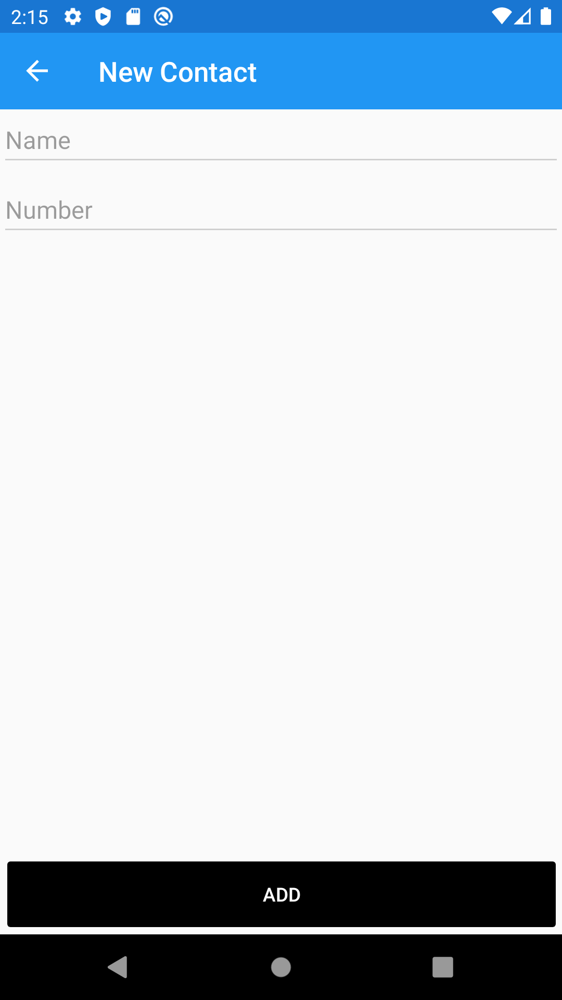

# Xamarin_ContactList
Basic Contact List App that supports CRUD operations using Xamarin Forms

## iOS Visuals (Iphone 8):
### Contact List Page

### Contact Context Menu

### Contact Action Sheet Options

### Contact Edit

## Android Visuals (Pixel 2):

### Contact List Page

### Contact Context Menu

### Contact Action Sheet Options

### Contact Edit

