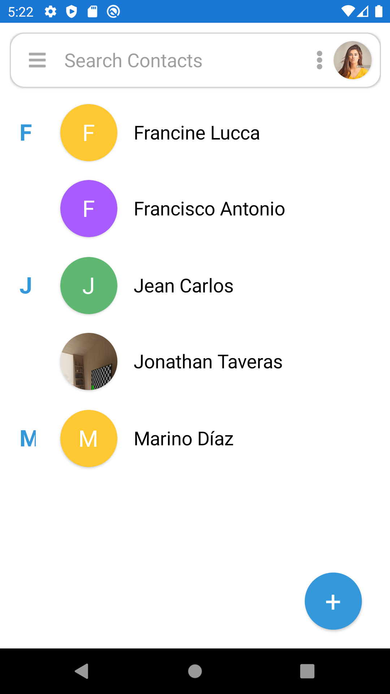

# Xamarin_ContactList
Basic Contact List App that supports CRUD operations using Xamarin Forms

## Android Visuals (Pixel 2):
### Main View

#### Contact List Page

#### Contact Context Menu

#### Contact Action Sheet Options

#### Contact Edit

### Google Replica

#### Contact List

#### Contact Edit

## iOS Visuals (Iphone 11):
### Main View

#### Contact List Page

#### Contact Context Menu

#### Contact Action Sheet Options

#### Contact Edit

### Google Replica

#### Contact List

#### Contact Edit

